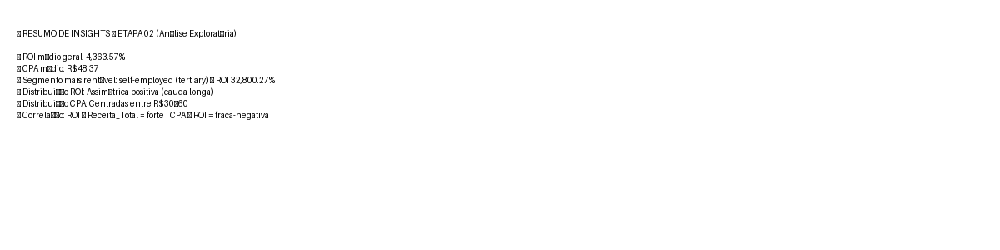

# 🏦 BK-DEP — Otimização de Conversão em Campanha Bancária  

[](https://www.python.org/)
[](https://jupyter.org/)
[](https://www.mysql.com/)
[](https://plotly.com/)
[](LICENSE)

> **Autor:** Bruno Aguiar  
> **Área de foco:** Marketing Analytics • Data Storytelling • Business Intelligence  
> 📊 **Objetivo:** Maximizar o ROI e otimizar a taxa de conversão de campanhas de depósito a prazo por meio de análise exploratória e segmentação baseada em dados.

---

## 📘 Sumário

1. [Sobre o Projeto](#sobre-o-projeto)
2. [Objetivos e Perguntas de Negócio](#objetivos-e-perguntas-de-negócio)
3. [Arquitetura do Projeto](#arquitetura-do-projeto)
4. [Fases de Desenvolvimento](#fases-de-desenvolvimento)
5. [Principais Resultados](#principais-resultados)
6. [Ferramentas Utilizadas](#ferramentas-utilizadas)
7. [Como Reproduzir](#como-reproduzir)
8. [Autor e Contato](#autor-e-contato)
9. [Licença](#licença)

---

## 🧠 Sobre o Projeto

O projeto **BK-DEP – Otimização de Conversão em Campanha Bancária** analisa os resultados de campanhas de **depósito a prazo** conduzidas por um banco fictício, com o objetivo de **maximizar o Retorno sobre o Investimento (ROI)** e **reduzir o Custo por Aquisição (CPA)**.

O estudo combina **análise exploratória (EDA)** e **modelagem preditiva** para identificar os perfis de clientes mais propensos à conversão e construir estratégias de alocação de recursos *data-driven*.

---

## 🎯 Objetivos e Perguntas de Negócio

**Objetivo central:**  
> Maximizar o ROI e a taxa de conversão por meio da análise de segmentos de clientes e do desempenho das campanhas.

**Perguntas respondidas:**
- Quais perfis (profissão, estado civil, educação) têm maior propensão à conversão?  
- Existe uma relação entre o investimento (CPA) e o retorno (ROI)?  
- Como redistribuir o orçamento de forma mais eficiente?  
- Quais segmentos entregam o melhor equilíbrio entre custo e retorno?

---

## 🏗️ Arquitetura do Projeto

BKDEP/
├── data/
│ ├── raw/ # Dados originais (bank_marketing.csv)
│ ├── processed/ # Dados tratados, normalizados e enriquecidos
│ └── outputs/ # Dados finais (dados_banco_merged.csv)
│
├── notebooks/
│ ├── 01_diagnostico_inicial.ipynb # Limpeza, EDA, KPIs iniciais
│ ├── 02_analise_exploratoria.ipynb # Segmentações, ROI, CPA, gráficos
│ └── 03_modelagem.ipynb # (Em construção) modelos preditivos
│
├── scripts/
│ ├── utils.py # Funções auxiliares
│ ├── pre_processamento.py # Pipeline ETL
│ └── analise_roi.py # Cálculos de ROI, CPA e resposta da campanha
│
├── assets/
│ └── etapa02_exploratoria/ # Gráficos exportados da análise exploratória
│
├── docs/
│ └── roadmap.md # Documentação técnica e planejamento
│
├── README.md # Documento principal
├── requirements.txt # Dependências Python


---

## 🧪 Fases de Desenvolvimento

### **🔹 Fase 1 — Diagnóstico e Limpeza** ✔
- Importação e padronização dos dados  
- Tratamento de inconsistências  
- Criação de novas features de negócio  

### **🔹 Fase 2 — Análise Exploratória e KPIs** ✔ Em andamento
- Taxa de conversão por segmento  
- ROI e CPA por profissão/educação  
- Heatmaps e correlações  
- Boxplots e visualizações avançadas  

### **🔹 Fase 3 — Modelagem Estatística** ⚙ Em construção
- Regressão logística  
- Árvores de decisão  
- Clusterização (K-Means/GMM)  

### **🔹 Fase 4 — Dashboard Final** 🟡 Planejado
- Power BI / Looker Studio  
- Storytelling analítico e recomendações  

---

## 📊 Principais Resultados (Parciais)

> 🔧 *Insights atualizados conforme avanço dos notebooks.*

- Perfis como **técnicos**, **administração** e **aposentados** apresentam maior propensão à conversão.  
- Segmentos com menor número de contatos demonstram **maior eficiência no CPA**.  
- O canal *cellular* possui conversão superior ao *telephone*.  
- Distribuições de ROI revelam concentração de alta performance em segmentos específicos.  
- Perfis de renda média demonstram equilíbrio ideal entre **custo** e **retorno**.

---

## 📸 Assets da Análise Exploratória

Todos os gráficos abaixo estão disponíveis em:

assets/etapa02_exploratoria/


### **1. Scatterplot — ROI vs CPA**
| Interativo | Estático |
|-----------|----------|
| `scatter_roi_cpa.html` | `scatter_roi_cpa.png` |


---

### **2. Boxplot — ROI por Profissão**
`boxplot_roi_profissao.png`


---

### **3. Top 10 Segmentos com Maior ROI**
`top10_segmentos_roi.png`


---

### **4. Heatmap — Correlação Entre Variáveis**
`heatmap_correlacao.png`


---

### **5. Distribuição Geral — ROI e CPA**
`distribuicao_geral_roi_cpa.png`


---

### **6. Resumo Visual de Insights**
`insights_resumo.png`



---

## 🛠 Ferramentas Utilizadas

| Categoria | Tecnologias |
|----------|-------------|
| Linguagem | Python 3.10 |
| Banco de Dados | MySQL 8.0 |
| Análise | Pandas, NumPy |
| Visualização | Matplotlib, Seaborn, Plotly |
| Modelagem | Scikit-Learn (em construção) |
| Documentação | Markdown |
| Ambiente | Jupyter Notebook |

---

## ▶️ Como Reproduzir

### **1. Clone o repositório**
```bash
git clone https://github.com/btaguiar/BK_DEP.git
cd BK_DEP

pip install -r requirements.txt

Execute os notebooks

Abra:

notebooks/01_diagnostico_inicial.ipynb

notebooks/02_analise_exploratoria.ipynb

---
## 👤 Autor e Contato

Bruno Aguiar
📊 Marketing Analytics & Data Intelligence
🔗 LinkedIn: https://www.linkedin.com/in/bruno-aguiar-marketing-analytics/

🔗 GitHub: https://github.com/btaguiar


