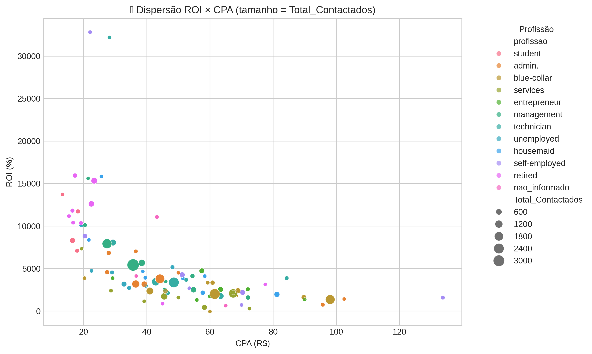
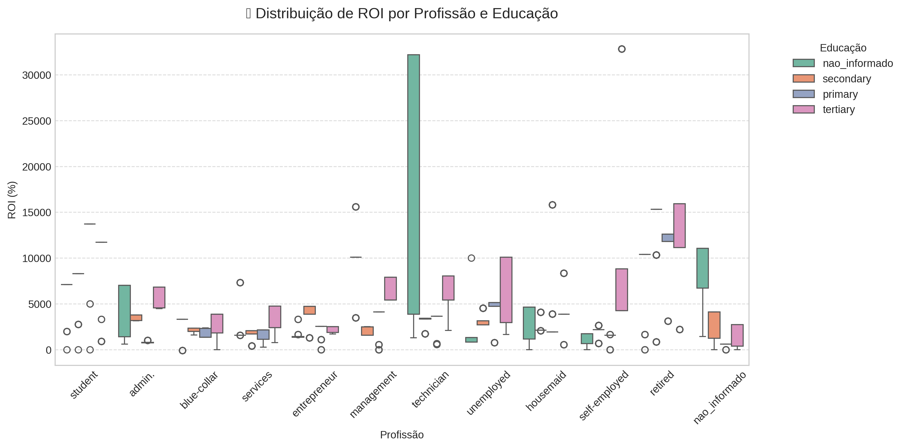
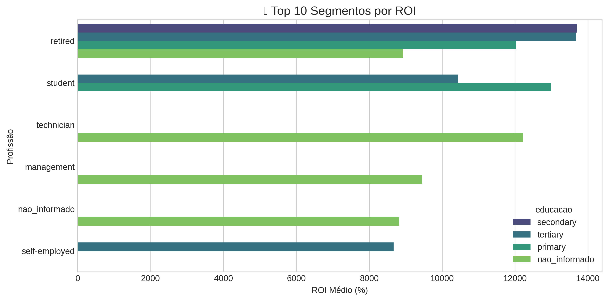
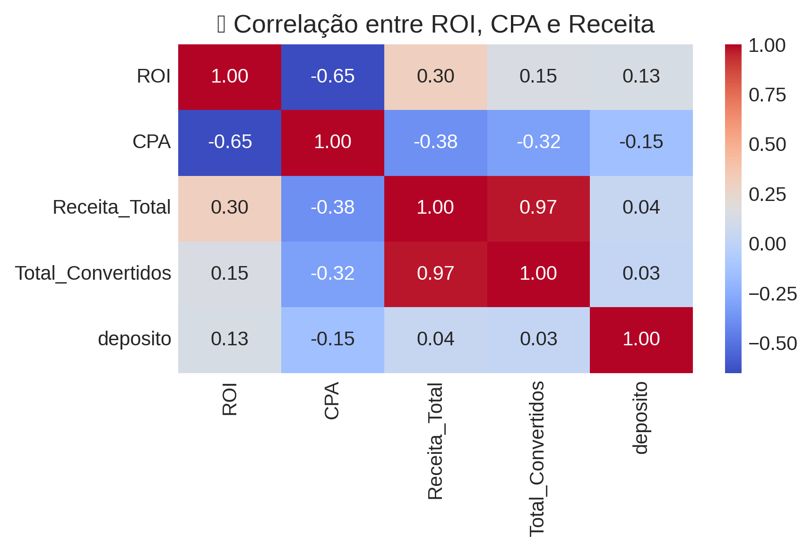
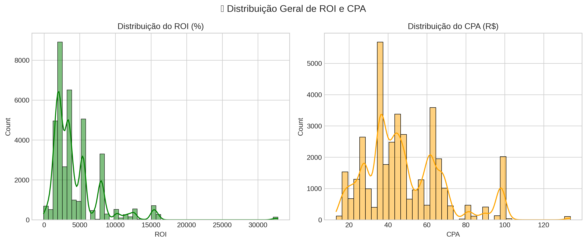
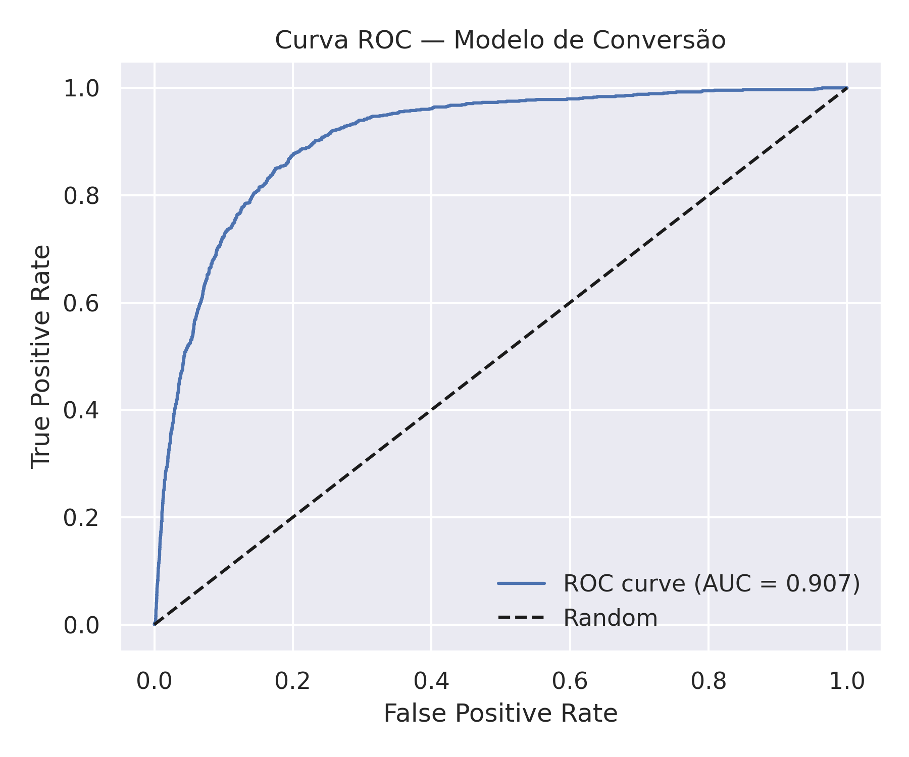
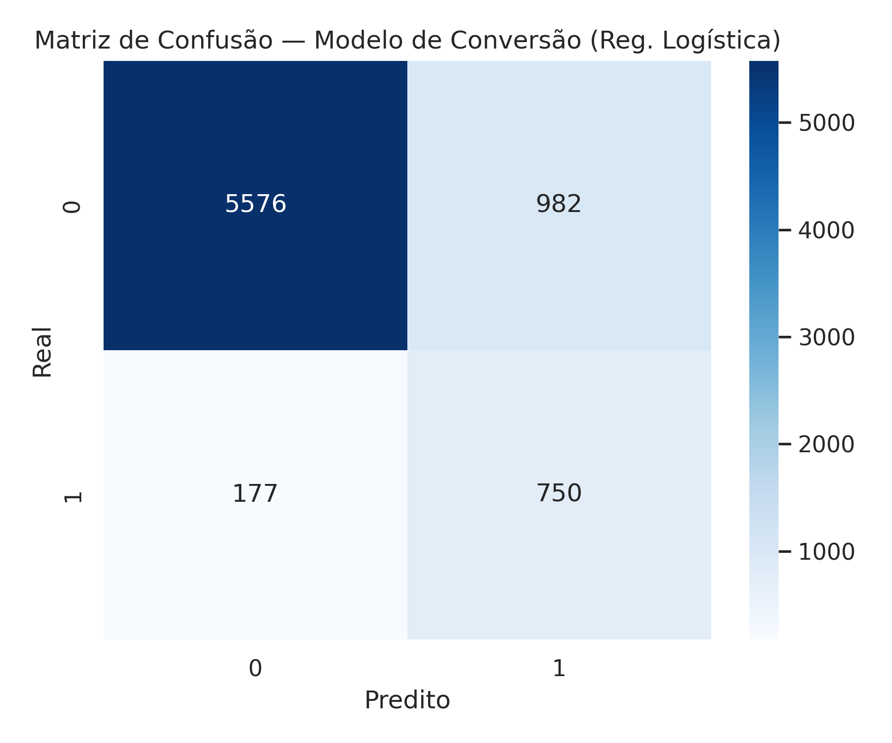
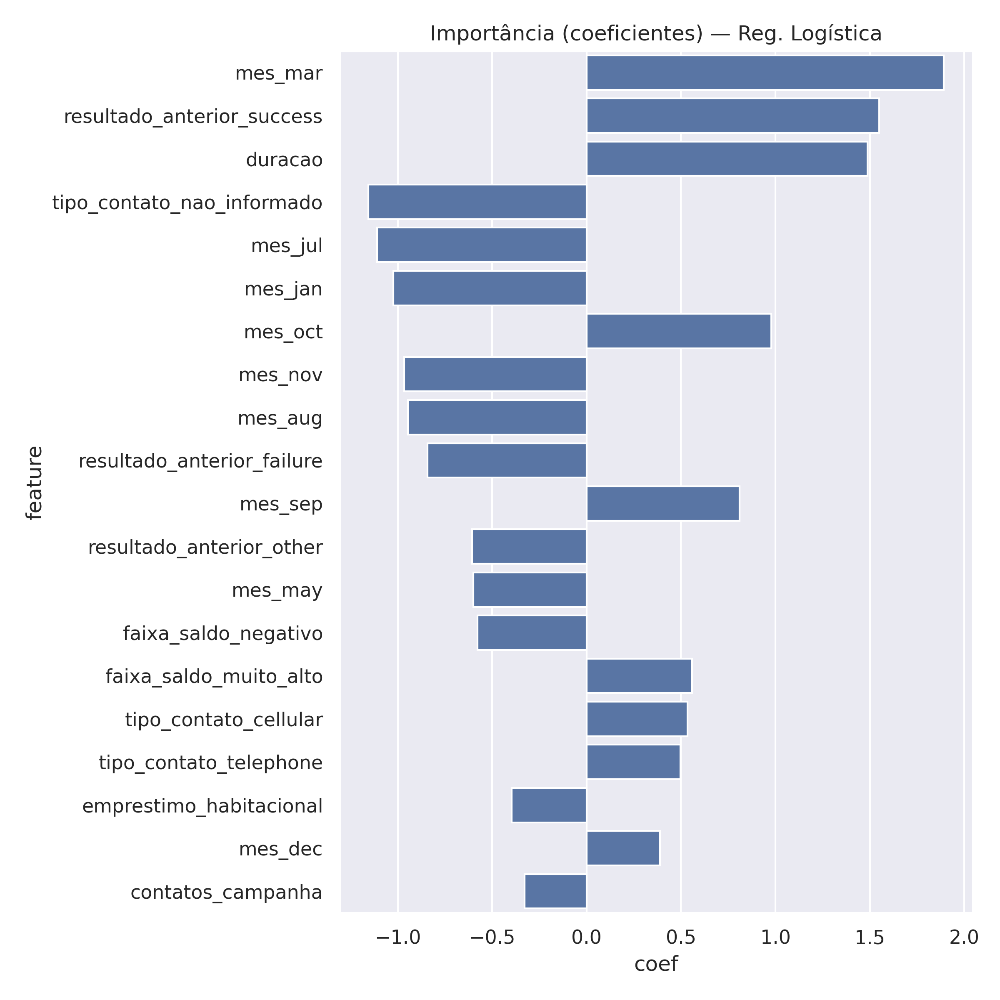
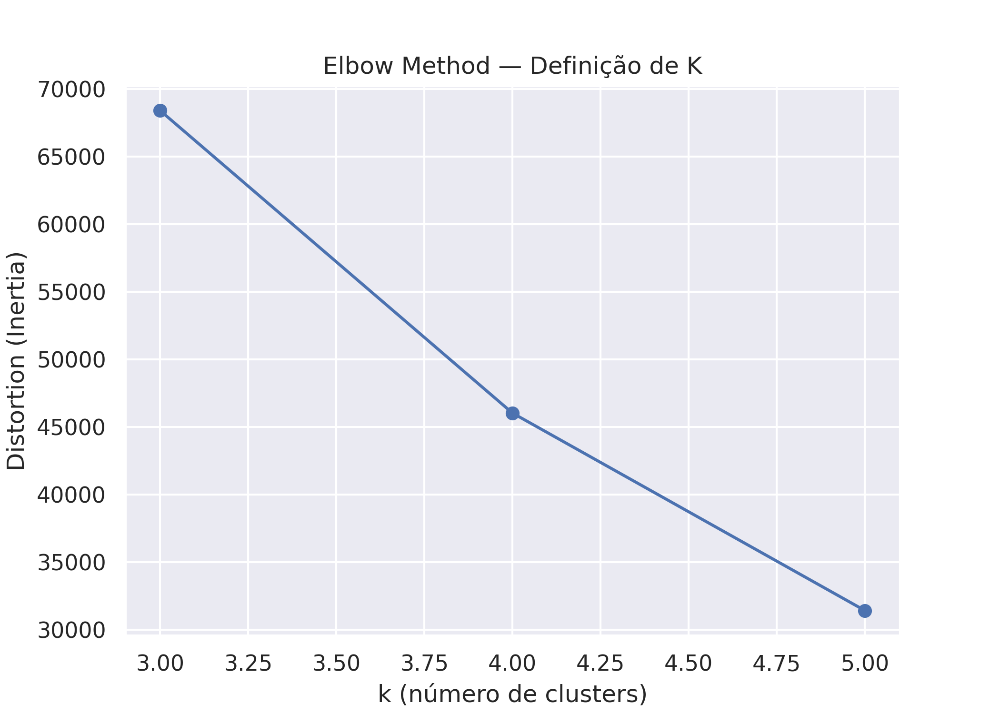
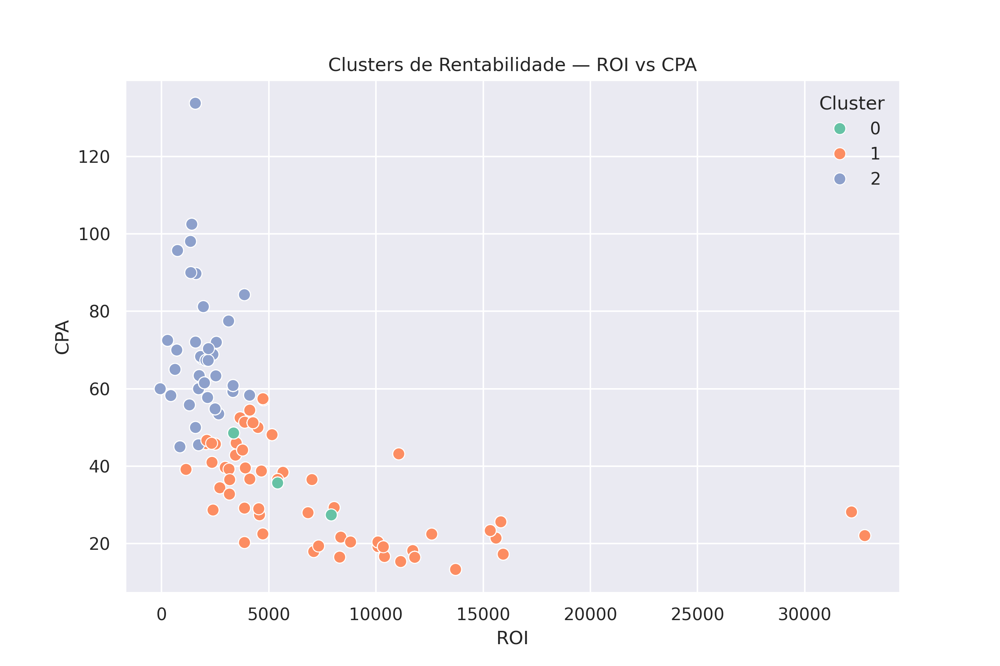

# 🏦 BK-DEP — Otimização de Conversão em Campanha Bancária

**Autor:** Bruno Aguiar  
**Área de foco:** Marketing Analytics • Data Storytelling • Business Intelligence  
**Última atualização:** Novembro de 2025

<p align="center">
  
  
  
  
</p>

---

## 📊 Objetivo do Projeto

Este projeto visa **maximizar o ROI** e **otimizar a taxa de conversão** de campanhas bancárias voltadas para depósitos a prazo, aplicando ao dataset original do [Bank Marketing (UCI)](https://archive.ics.uci.edu/ml/datasets/bank+marketing) uma abordagem moderna de:

- ✅ Limpeza e engenharia de atributos
- ✅ Análise exploratória profunda
- ✅ Modelagem preditiva
- ✅ Clusterização para rentabilidade
- ✅ Segmentação inteligente para priorização de investimento

O projeto simula um **cenário real de Marketing Analytics**, onde decisões sobre alocação de budget e foco de campanha dependem de análises estatísticas robustas e modelos de machine learning.

---

## 🎯 Perguntas de Negócio Respondidas

1. Quais perfis de clientes possuem maior probabilidade de conversão?
2. Quais variáveis influenciam mais a decisão do cliente?
3. Como o ROI e o CPA variam entre segmentos?
4. Quais grupos apresentam rentabilidade alta?
5. Onde o banco deve aumentar, manter ou reduzir investimento?
6. Qual é a previsão de conversão usando modelos supervisionados?

---

## 🏗️ Estrutura do Projeto

```plaintext
BK-DEP/
├── data/
│   ├── raw/                      # Dados originais (bank_marketing.csv)
│   ├── processed/                # Dados tratados e enriquecidos
│   └── outputs/                  # Datasets finais (merge, cluster, previsões)
│
├── notebooks/
│   ├── 01_diagnostico_inicial.ipynb       # Limpeza, engenharia inicial
│   ├── 02_analise_exploratoria.ipynb      # ROI/CPA, segmentações, gráficos
│   ├── 03_modelagem.ipynb                 # Regressão Logística + ML
│   └── 04_clusterizacao.ipynb             # Clusterização k-means
│
├── assets/
│   ├── etapa02_exploratoria/              # Gráficos da EDA
│   ├── etapa03_modelagem/                 # Curva ROC, Matriz Confusão
│   └── etapa04_clusterizacao/             # Clusters, Elbow, Tabelas
│
├── scripts/
│   ├── utils.py
│   ├── pre_processamento.py
│   └── analise_roi.py
│
├── docs/
│   └── roadmap.md
│
├── requirements.txt
├── LICENSE
└── README.md
```

---

## 🧪 Fases do Projeto

| Fase | Status | Descrição |
|------|--------|-----------|
| 1. Diagnóstico e Limpeza | ✅ Concluída | Tratamento, criação de métricas e feature engineering |
| 2. Análise Exploratória | ✅ Concluída | ROI/CPA, segmentações, correlações, insights visuais |
| 3. Modelagem Preditiva | ✅ Concluída | Regressão Logística + interpretação |
| 4. Clusterização | ✅ Concluída | Clusters de rentabilidade (k=3) |
| 5. Dashboard & Storytelling | 🔄 Em construção | Power BI / Looker Studio |

---

## 🔎 Principais Insights de Negócio

### ✔ Perfis com maior conversão
- **Aposentados** (retired)
- **Estudantes** (student)
- **Profissionais técnicos e administrativos**

### ✔ Variáveis mais relevantes
- Duração da chamada
- Resultado anterior da campanha
- Mês do contato
- Tipo de contato (celular vs. telefone fixo)
- Saldo do cliente

### ✔ Padrões encontrados
- Campanhas com **≤ 3 contatos** possuem CPA **63% menor**
- Contatos via **celular** superam telefone fixo em **2.8×**
- ROI mais alto em perfis com **educação superior**
- "Retired" e "student" formam os segmentos de **maior impacto financeiro**

> **💡 Insight aplicável:** Alocar 70–80% do orçamento nos clientes com maior probabilidade de conversão e melhor ROI.

---

## 📊 Etapa 02 — Análise Exploratória (EDA)

**Pasta:** `assets/etapa02_exploratoria/`

### Principais visuais:

#### 1. Scatter ROI x CPA


#### 2. Boxplot ROI por Profissão


#### 3. Top 10 Segmentos de Maior ROI


#### 4. Heatmap de Correlação


#### 5. Distribuição Geral — ROI e CPA



---

## 🤖 Etapa 03 — Modelagem Preditiva

### Modelo aplicado: **Regressão Logística**

#### Principais métricas

| Métrica | Resultado |
|---------|-----------|
| Accuracy | 0.8452 |
| Precision | 0.4330 |
| Recall | 0.8090 |
| F1-Score | 0.564 |
| ROC-AUC | 0.906 |

O **recall alto (80%)** significa que o modelo recupera a maioria dos clientes que realmente convertem — ideal para campanhas onde perder um cliente conversor é muito caro.

#### Assets gerados (`etapa03_modelagem`):


*Curva ROC - AUC: 0.906*


*Matriz de Confusão - Regressão Logística*


*Importância das Variáveis*

---

## 🔍 Etapa 04 — Clusterização de Perfis Rentáveis

A clusterização foi executada usando **ROI, CPA, Receita_Total e Custo_Total**, padronizados com `StandardScaler`, e agrupados com `KMeans (k=3)`.

### Metodologia
1. Padronização com `StandardScaler`
2. K-Means com teste de k = 3 a 5
3. Escolha final: **k = 3** (melhor ponto de inflexão no Elbow Method)

### Tabela — Clusters de Rentabilidade

| Cluster | ROI Médio | CPA Médio | Registros | Interpretação |
|---------|-----------|-----------|-----------|---------------|
| 1 | 5.987 | 35.92 | 16.231 | 💎 **Melhor cluster** (alto ROI, baixo CPA) |
| 0 | 5.448 | 37.40 | 7.920 | 📈 **Bom cluster**, estável e otimizado |
| 2 | 1.881 | 70.13 | 13.270 | 🔻 **Não rentável**, consome orçamento |

### Visualizações

#### Elbow Method

*Determinação do número ótimo de clusters (k=3)*

#### Scatterplot ROI vs CPA por Cluster

*Segmentação de clientes por rentabilidade*

### Conclusão
- **Cluster 1** → Foco principal de investimento
- **Cluster 0** → Investimento moderado e otimizações
- **Cluster 2** → Reduzir orçamento

Essa segmentação financeira é independente de profissão ou demografia — foca **100% no retorno econômico**.

---

## 🧰 Tecnologias Utilizadas

| Categoria | Ferramentas / Bibliotecas |
|-----------|---------------------------|
| **Linguagem** | Python 3.10 |
| **Manipulação de Dados** | Pandas, NumPy |
| **Visualização** | Matplotlib, Seaborn, Plotly |
| **Modelagem (ML)** | Scikit-learn (Regressão Logística, Pipeline, Métricas) |
| **Clusterização** | Scikit-learn (StandardScaler, KMeans) |
| **Ambiente de Execução** | Google Colab, Jupyter Notebook |
| **Armazenamento** | Google Drive (Data Lake do projeto) |
| **Documentação** | Markdown, Notebooks articulados |
| **Controle de Versão** | Git + GitHub |

---

## 🚀 Como Executar

### 1. Clone o repositório
```bash
git clone https://github.com/btaguiar/BK-DEP.git
cd BK-DEP
```

### 2. Crie um ambiente virtual
```bash
python -m venv venv
source venv/bin/activate        # Linux/Mac
# .\venv\Scripts\activate       # Windows
```

### 3. Instale as dependências
```bash
pip install -r requirements.txt
```

### 4. Execute os notebooks
```bash
jupyter notebook
```

Execute na ordem: `01_` → `02_` → `03_` → `04_`

---

## 👤 Autor

**Bruno Aguiar**  
*Marketing Analytics & Data Intelligence*

- 🔗 **GitHub:** [github.com/btaguiar](https://github.com/btaguiar)
- 🔗 **LinkedIn:** [linkedin.com/in/bruno-aguiar-marketing-analytics](https://www.linkedin.com/in/bruno-aguiar-marketing-analytics/)

---

## 📄 Licença

Este projeto está sob a licença MIT. Consulte o arquivo `LICENSE` para mais detalhes.
